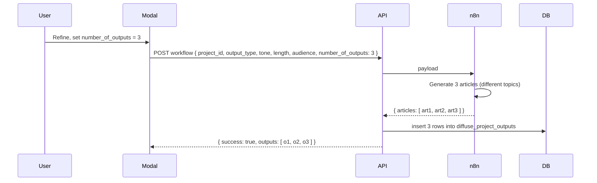

# Generate Options: Quick Generate, Refine Quiz, and Saved Settings

## Current behavior

- **Single button:** "Generate with diffuse.ai" opens a dropdown with "Generate Article" and "Generate Ad".
- **API:** `POST /api/workflow` with `{ project_id, output_type }`. Payload to n8n includes `project_id`, `output_type`, `inputs`, `cover_photo_url`, `photo_credit`.
- **Saving:** One output per run; single insert into `diffuse_project_outputs`.

---

## Four questions to pass to the workflow

| # | Question | Payload key | Options |
|---|----------|-------------|---------|
| 1 | **Tone** | `tone` | Professional, Conversational, Urgent, Neutral, Friendly; 6th option "Other" with short text field. |
| 2 | **Length** | `length` | Short (brief), Medium (standard), Long (in-depth). |
| 3 | **Audience** | `audience` | General reader, Local community, Expert/industry, Youth-friendly; optional "Other" with text. |
| 4 | **Number of outputs** | `number_of_outputs` | 1, 2, 3, 4, or 5. When > 1, used for long recordings: generate multiple articles, each around a different topic. |

- **Tone** and **Audience** improve voice and vocabulary; **Length** controls scope; **Number of outputs** lets users get multiple distinct articles from one long recording (e.g. one article per major topic).

---

## Number of outputs: behavior and implementation

### User-facing

- In the refine modal: "How many articles?" with options **1** (single article), **2**, **3**, **4**, **5**. Helper text: e.g. "Use 2+ for long recordings – each article will focus on a different topic."
- Quick generate (no quiz): always 1 output; `number_of_outputs` omitted or sent as 1.

### API and n8n

- **Request:** Include `number_of_outputs` (integer 1–5) in the workflow request body when present. Validate and sanitize; default to 1 when omitted.
- **n8n:** When `number_of_outputs` > 1, workflow should produce multiple articles (e.g. split long content by topic and generate one article per topic). Response shape must support multiple articles (see below).

### Response shape when multiple outputs

- **Option A (recommended):** n8n returns a single JSON object that contains an array of articles, e.g. `{ "articles": [ { ...article1... }, { ...article2... } ] }`. API parses `n8nResult.articles` (or equivalent), adds `author: 'Diffuse.AI'` to each, and inserts one row per article into `diffuse_project_outputs` (same `project_id`, `output_type`, `cover_photo_path`; each row has its own `content`). Response to client: `{ success: true, outputs: [...] }` (array).
- **Option B:** n8n returns an array of article JSONs at the top level. API iterates and inserts each; response same as above.

### App (workflow route)

- **Extract:** After getting `n8nResult`, if `number_of_outputs` > 1, look for `n8nResult.articles` (or top-level array) and treat as list of article objects. If `number_of_outputs === 1` or not set, keep current behavior: single `extractArticleContent` result, one insert.
- **Insert:** Loop over each article (or single item), parse/add author, insert into `diffuse_project_outputs`. Return all created outputs in the response so the frontend can switch to outputs tab and show each new card.

### Frontend

- **Project page:** After generate, if response contains `outputs` (array), refresh project data and switch to outputs tab as today; all new outputs will appear. No change needed if API returns `outputs: [output]` for single and `outputs: [o1, o2, ...]` for multiple.

---

## UX options for the three paths (unchanged)

- **Option A (recommended):** One button + dropdown. Items: "Generate Article", "Generate Ad", divider, "Refine and generate…". Refine opens 4-question modal; at end user picks Article/Ad and Generate; optional "Save as default" (localStorage or future API).
- **Option B:** Two buttons: "Quick generate" (dropdown Article/Ad), "Refine and generate" (modal).
- **Option C:** Single button opens modal with Quick (Article/Ad) and Refine (quiz) inside.

Saved settings: same as before (e.g. localStorage key `diffuse_workflow_preferences` with tone, length, audience, number_of_outputs); pre-fill modal when opening Refine.

---

## Implementation summary (with number_of_outputs)

### 1. API and n8n payload

- **Validation:** Allow optional `tone`, `length`, `audience` (strings, max length), and `number_of_outputs` (integer 1–5, default 1).
- **Payload:** Add to `n8nPayload` when present: `tone`, `length`, `audience`, `number_of_outputs`.

### 2. Workflow route: multiple outputs

- If `number_of_outputs` > 1: parse n8n response for array of articles (`n8nResult.articles` or top-level array); for each, add author, then insert one row into `diffuse_project_outputs`. Return `{ success: true, outputs: [...] }`.
- If `number_of_outputs` === 1 or omitted: keep current single-article extract and single insert; return `{ success: true, output, ... }` for backward compatibility (frontend can treat `output` as single-item list if needed).

### 3. Refine modal (4 questions)

- Step 1: Tone (5 + Other). Step 2: Length (3). Step 3: Audience (4 + Other). Step 4: Number of outputs (1–5) with helper text for long recordings.
- Final step: Article/Ad + Generate; optional Save as default. Pass `number_of_outputs` in the generate payload.

### 4. n8n workflow (documentation)

- Document that webhook may receive `number_of_outputs`. When > 1, return structure with multiple articles (e.g. `{ "articles": [ ... ] }`) so the API can insert multiple rows.

---

## Data flow (multi-output)

---

No other changes to the original plan except adding the fourth question and the multiple-output behavior above.
